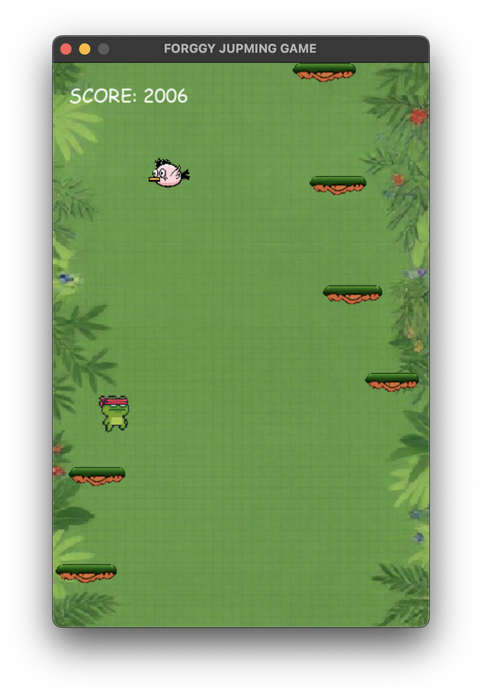
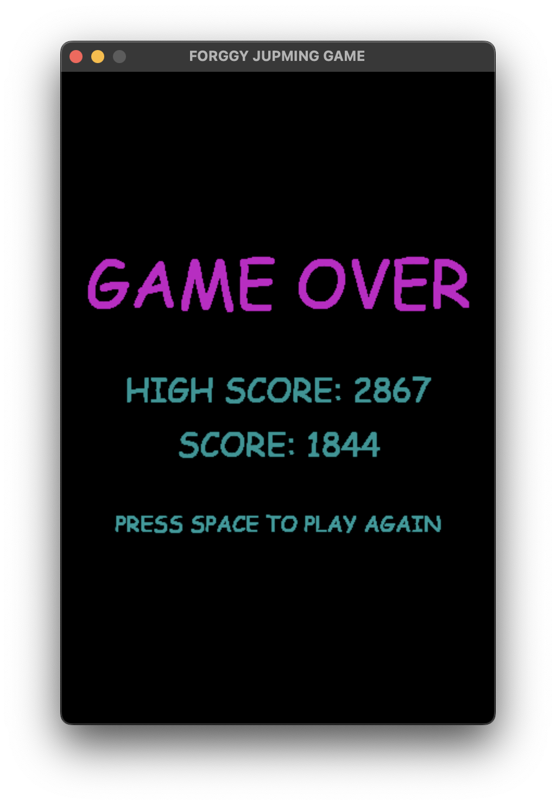
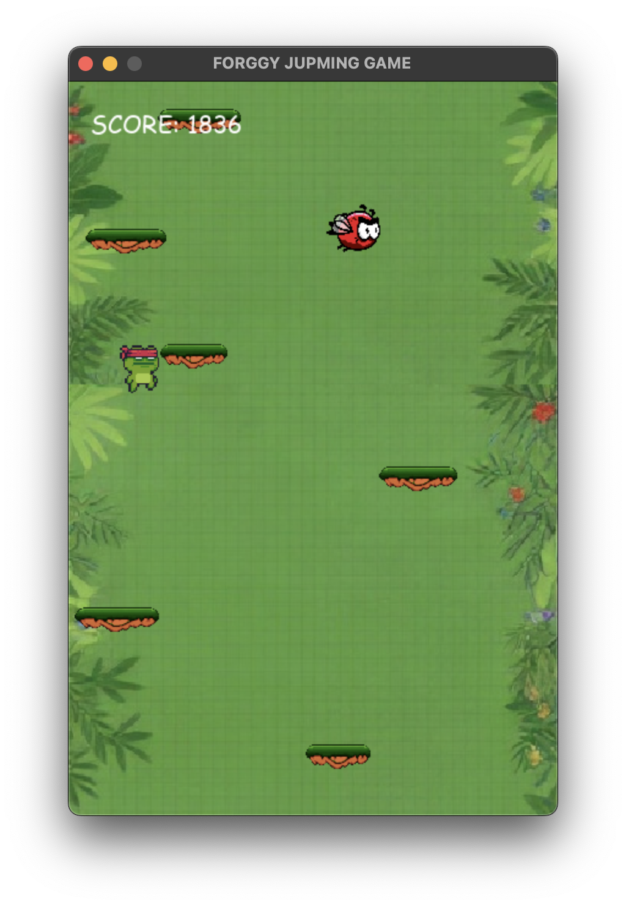

# ARABIC 
## لعبه الضفدع القافز ب pygame
هي لعبه بسيطه الهدف هو الحصول علي اعلي سكور  اللاعب هو ضفدع يقفز دائما لأعلى يجب عليك توجيهه لليمين و اليسار لكي تتخطي العقبات مثل الطيور الاعداء و المنصات المتحركه
### مميزات اللعبه
- تزداد الصعوبه كلما ازداد الاسكور
- حفظ اعلي سكور في اللعبه
- المؤثرات الصوتيه
- سهوله التحكم وسرعه الاستجابه للاعب

### ماذا تعلمت
- خصائص فيزيائيه لجعل اللاعب يقفز بواقعيه
- كما تطورت في تنظيم الكود في pygame  واستخدام classes
- عمل انيميشن للطيور وشاشه الخساره

### كيفيه التشغيل للماك
في Releases نزل الملف `game_for_mac.zip`

### كيفيه التشغيل للوندوز
في Releases نزل الملف `game_for_windows.zip`

### التشغيل محليا
- تأكد اولا من أن python  مثبته علي جهازك
- نزل الكود من جت هب 
دوس زرار  الاخضر مكتوب عليه **code**  في الاعلي
أو اعمل `git clone`
- اختار **Download ZIP**
- فك الضغط وافتح المشروع في vscode  او اي محرر اكواد
- واكتب في الترمنتال 
`pip install -r requirements.txt`
- وبعدها اكتب `python game.py` واستمتع

# English

## Frogy jumping Game in Pygame

It is a simple game where the goal is to get the highest score. The player is a frog that is always jumping upward. You must guide it to the right and left to avoid obstacles such as birds, enemies, and moving platforms.

### Game Features

- The difficulty increases as the score increases
- Saving the highest score in the game
- Sound effects
- Easy controls and fast player response

### What I Learned

- Physics properties to make the player jump realistically
- I also improved my skills in organizing code in Pygame and using classes
- Creating animations for birds and a game-over screen

### How to Run on Mac

In Releases, download the `game_for_mac.zip` file.

### How to Run on Windows

In Releases, download the `game_for_windows.zip` file.

### Running Locally

- First, make sure that Python is installed on your device
- Download the code from GitHub
- Press the green **Code** button at the top
- Or use `git clone`
- Choose **Download ZIP**
- Extract the files and open the project in VS Code or any other code editor
- Write in the terminal:
`pip install -r requirements.txt`
- After that, write:
`python game.py`

# very Important note
### becouse my English is weak i translate the readme file form arabic to english to used ChatGPT 

# Images

